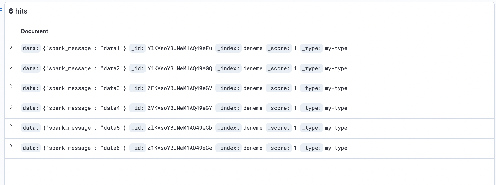

___
### Spring Boot  Kafka Flink Elastic Example

---
Sinking the data consumed with Flink to ElasticSearch

### Summary
Sinking the data produced with Kafka and the data consumed with flink kafka to ElasticSearch

#### Executing the Repo

*  With docker-compose up, docker containers are raised
*  http://localhost:9000/ is entered into the porttainer. The healthy operation of the containers is checked.
*  Producer.py is run. The data is produced by kafka.
*  http://0.0.0.0:9090/ kafka topigi is checked.
*  spring-boot project is run
*  Data is checked from http://0.0.0.0:5601/.

